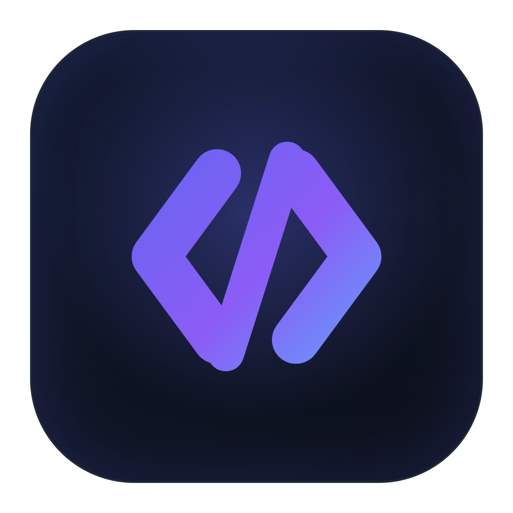
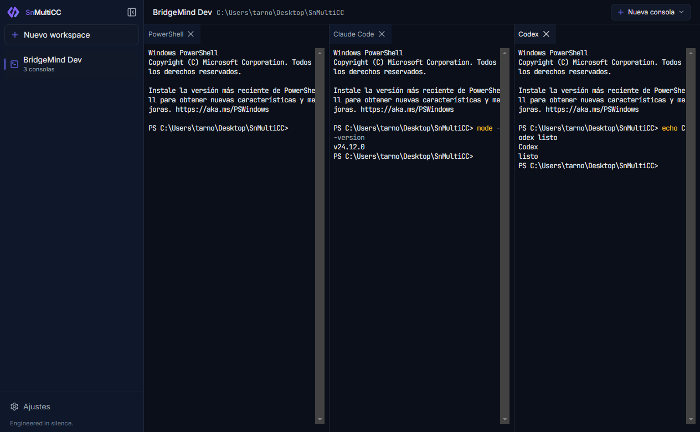

<div align="center">



# SnMultiCC — Multi Command Consoles

**A personal command center for the `Sn` brand.**
Open *sets* of multiple terminals and AI CLI sessions (Claude Code, Codex, custom) in a draggable mosaic — a branded, multi-agent workspace.

*Engineered in silence.*

</div>



---

> **Status:** `v0.1.0` — building in public as a VibeCoding showcase. Open source under MIT.

## What it is

A collapsible sidebar lists **workspaces** (not chats). Opening a workspace shows a **draggable / resizable dockable mosaic** of real shells (PowerShell on Windows, zsh/bash on macOS/Linux) and AI CLI panes. Each workspace remembers its directory, panes, and exact layout; reusable **agent presets** let you launch N sessions of Claude Code / Codex / any custom command in one click.

## Features

- 🖥️ **Real terminals** — true PTYs via `node-pty` + `xterm.js` (WebGL renderer, canvas fallback)
- 🧩 **Draggable mosaic** — split, resize, tab and re-dock panes (`dockview`); layout is saved per workspace
- 🤖 **Agent presets** — Shell / Claude Code / Codex out of the box; define your own custom AI CLIs in Settings
- 📁 **Per-workspace directory** — pick any folder; every console opens there
- 💾 **Persistent** — workspaces, presets, settings and layout restore on launch
- 🎨 **Sn branding** — the same dark design system as the SnDevelopment web
- 📦 **Portable + installable** — Windows 10+, macOS, Linux

## Download

Grab the latest build from **[Releases](https://github.com/ValentinTarnovsky/SnMultiCC/releases)**:

| Platform | Artifact |
|----------|----------|
| Windows (installer) | `SnMultiCC-x.y.z-setup.exe` |
| Windows (portable) | `SnMultiCC-x.y.z-portable.exe` — stores its config next to the `.exe` |

> macOS (`.dmg`/`.zip`) and Linux (`.AppImage`/`.deb`) targets are configured; build them from source on their own OS (`npm run dist:mac` / `dist:linux`) until CI artifacts are published.
> Builds are unsigned for now — Windows SmartScreen / macOS Gatekeeper may warn on first launch.

## Tech

- **Electron** + **React** + **Vite** + **TypeScript** (via [`electron-vite`](https://electron-vite.org))
- Terminals: [`xterm.js`](https://xtermjs.org) + [`node-pty`](https://github.com/microsoft/node-pty) (N-API, no native rebuild)
- Layout: [`dockview`](https://dockview.dev) · State: `zustand` · Validation: `zod`
- Styling: **Tailwind CSS v4**, `framer-motion`, `lucide-react`
- Packaging: `electron-builder`

## Development

```bash
npm install
npm run dev        # launch with HMR
npm run typecheck  # type-check main + renderer
```

## Build

```bash
npm run pack:dir   # unpacked app (quick sanity build)
npm run dist:win   # Windows: NSIS installer + portable .exe
npm run dist:mac   # macOS: dmg + zip
npm run dist:linux # Linux: AppImage + deb
```

## License

[MIT](./LICENSE) © Valentin Tarnovsky
