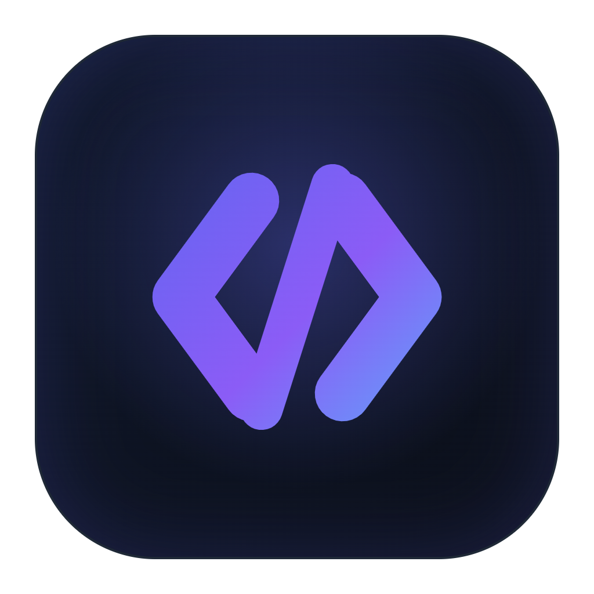
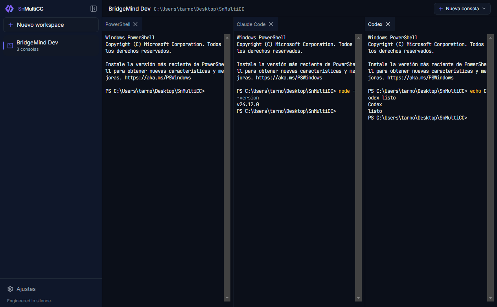

<div align="center">



# SnMultiCC · Multi Command Consoles

**A personal command center for the `Sn` brand.**
Open *sets* of multiple terminals and AI CLI sessions (Claude Code, Codex, custom) in a draggable mosaic: a branded, multi-agent workspace.

*Engineered in silence.*

[](https://github.com/ValentinTarnovsky/SnMultiCC/actions/workflows/ci.yml)
[](https://github.com/ValentinTarnovsky/SnMultiCC/actions/workflows/release.yml)
[](./LICENSE)

</div>



---

> **Status:** `v1.14.1`, stable. Built in public as a VibeCoding showcase, open source under MIT.

## What it is

A collapsible sidebar lists **workspaces** (not chats). Opening a workspace shows a **tiling mosaic** of real shells (PowerShell on Windows, zsh/bash on macOS/Linux) and AI CLI panes. Each workspace remembers its directory, its panes, and its exact grid layout. Reusable **models** (agent presets) let you launch N sessions of Claude Code / Codex / any custom command in one click, and reusable **connection profiles** can SSH into a box and log in automatically before the model even starts.

## Features

- 🖥️ **Real terminals**: true PTYs via `node-pty` + `xterm.js`, GPU-accelerated (WebGL, with an automatic Canvas fallback so heavy AI-CLI redraws never glitch).
- 🧩 **Tiling mosaic**: a fixed, drag-to-reorder grid (1 to 12 panes). Maximize a pane, reorder by dragging its header, middle-click to close. Layout is saved per workspace.
- 🤖 **Models**: Shell / Claude Code / Codex out of the box. Define your own custom AI CLIs (command, args, env, default directory) in Settings.
- 🔌 **Connection profiles**: reusable pre-launch sequences (for example, SSH into a server). Each step waits for the console to print something (like `password:`) and then sends the next line, so a whole login flow runs automatically across every console in the workspace.
- 📁 **Per-workspace directory**: pick any folder, every console opens there.
- 🔎 **Built for long sessions**: infinite (or capped) scrollback, in-pane find, a command palette (`Ctrl/Cmd+K`), and saved prompt snippets.
- ⌨️ **Remappable keyboard shortcuts** and an optional global hotkey to summon the window from anywhere.
- 🎨 **Themes + i18n**: Midnight, Light, Nord, Dracula, Solarized and a fully custom palette. English and Spanish.
- 🪟 **Native feel**: frameless custom title bar, tray integration, launch on startup, crash-safe config with automatic backups.
- 📦 **Portable + installable**: Windows 10+, macOS (Intel + Apple Silicon), Linux.

## Agent status and notifications

Open **Settings > Notifications** to enable the integrations:

1. **Claude:** install or repair the status hooks, then restart the Claude session. Existing third-party hooks are preserved. Settings show whether hooks are complete and events have arrived.
2. **Codex:** enable the local integration and restart the console. Interactive `codex` commands use a private App Server for each console, preserving the shell environment and directory. Existing sessions keep their transport until they exit. Requires a native Codex executable in PATH supporting `app-server --stdio` and `--remote` (tested with 0.157.1).
3. **Discord:** enter a webhook URL and your Discord user ID, enable delivery, and use **Send test to Discord**. Leave the user ID empty for messages without a ping. Intervention/failure and turn-completion messages have separate switches. Discord works while the app is focused and independently of desktop notifications.

Use **Test desktop notification** to check the system channel. If Windows blocks it, enable SnMultiCC under **Windows Settings > System > Notifications**. The app reports native delivery errors in its notification settings.

Console headers and both sidebar layouts show violet for working, amber for pending input, green for a completed turn, red for failure, gray for idle, and a hollow dot for lost status. Pending requests remain visible while an agent continues working. Sidebar counters include hidden consoles in the active workspace.

In the phone web client, vertical finger drags also scroll applications that capture the mouse, such as Claude. These gestures become terminal wheel events; regular shell scrollback, horizontal pan and taps to open the keyboard retain their usual behavior.

Integration limits: remote SSH/WSL sessions, explicit executable paths, `--remote`, and `--no-daemon` bypass the local Codex launcher. Initial login/trust dialogs and free-form questions may not emit structured events; completion notifications cover the end of those responses. Claude title fallback is approximate. Codex async message questions are acknowledged when the server accepts the next user input; individually identified RPC requests resolve separately.

Discord sends only provider, workspace/pane names, reason and time. Webhook URLs remain in the local config and its backups, are hidden in the UI, and are removed from config exports. No prompts, command output, or terminal contents are sent. A network timeout can leave delivery unconfirmed; the app reports it without blindly duplicating the message.

## Connection profiles (SSH and more)

Define a profile once in **Settings → Connections**, then pick it when you create a workspace and it applies to every console:

1. `send` &nbsp;`ssh root@your-server`
2. `wait` for `password:` &nbsp;then `send` your password (stored masked)
3. `wait` for the shell prompt &nbsp;then `send` `cd /your/path`
4. ... the model command (Claude Code, Codex, ...) runs once the sequence finishes.

Each step supports a fixed delay, a wait timeout (it proceeds anyway if the text never appears), a `secret` flag that masks the value in the UI, and substring or `/regex/` matching. The sequence runs in the main process, so it keeps going even if the UI reloads, and every console runs it independently (so N consoles all connect in parallel).

## Download

Grab the latest build from **[Releases](https://github.com/ValentinTarnovsky/SnMultiCC/releases)**:

| Platform | Artifact |
|----------|----------|
| Windows (installer) | `SnMultiCC-x.y.z-setup.exe` |
| Windows (portable) | `SnMultiCC-x.y.z-portable.exe` (stores its config next to the `.exe`) |
| macOS | `SnMultiCC-x.y.z.dmg` / `-mac.zip` (x64 + arm64) |
| Linux | `SnMultiCC-x.y.z.AppImage` / `.deb` |

> CI builds and attaches all three platforms to the release on every `v*` tag (see `.github/workflows/release.yml`).
> Builds are unsigned for now, so Windows SmartScreen / macOS Gatekeeper may warn on first launch.

## Tech

- **Electron** + **React** + **Vite** + **TypeScript** (via [`electron-vite`](https://electron-vite.org)).
- Terminals: [`xterm.js`](https://xtermjs.org) + [`node-pty`](https://github.com/microsoft/node-pty) (N-API, no native rebuild).
- State: `zustand` · Validation + config schema: `zod` · Layout: a custom CSS-grid tiling engine.
- Styling: **Tailwind CSS v4**, `framer-motion`, `lucide-react`.
- Packaging: `electron-builder`.

## Development

```bash
npm install
npm run dev        # launch with HMR
npm run typecheck  # type-check main + renderer
npm test           # status, protocol, hook transport and Discord regressions
npm run test:ui    # isolated Electron visual smoke, after npm run build
npm run test:mobile # real xterm touch-scroll regression, after npm run build:mobile
```

## Build

```bash
npm run pack:dir   # unpacked app (quick sanity build)
npm run dist:win   # Windows: NSIS installer + portable .exe
npm run dist:mac   # macOS: dmg + zip
npm run dist:linux # Linux: AppImage + deb
```

## License

[MIT](./LICENSE) © Valentin Tarnovsky
